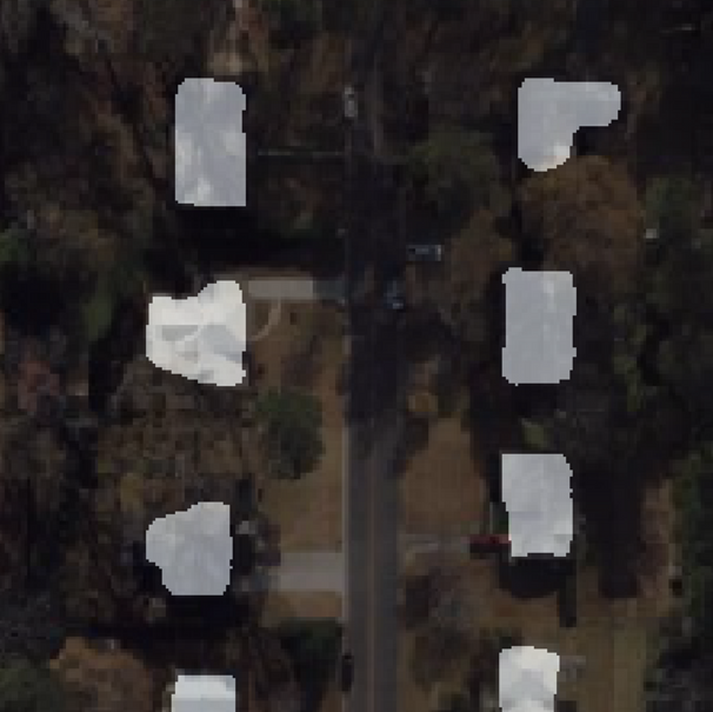
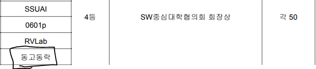
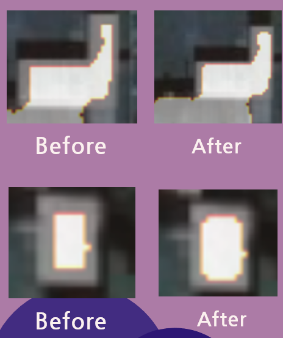
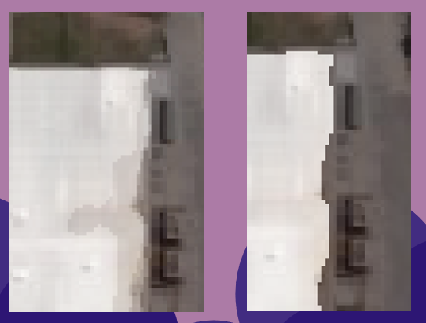

# semantic segmentation 

SW중심대학 공동 AI 경진대회 2023

최종결과 : 공동 4등 (SW중심대학협의회 회장상)

위성 데이터 건물 semantic segmentation

   
  
   
  
  [pdf](https://github.com/leadawon/building_segmentation_dgdr/blob/master/assets/%5Bdgdr%5Dfinal_ppt.pdf) < - PLEASE CLICK THIS TO SEE MORE DETAILS!
  

## 프로젝트 소개
SW중심대학 공동 AI 경진대회 2023

위성 dataset을 건물, 비건물로 segmentation 합니다.

[dacon](https://dacon.io/competitions/open/236092/overview/description) 에서 dice score를 기준으로 competition을 진행합니다.

최종결과는 공동 4등으로 SW중심대학협의회 회장상과 50만원의 상금을 수령했습니다.

 

## 기술 스택

  </a>&nbsp 
  </a>&nbsp
  </a>&nbsp 
  </a>&nbsp
  </a>&nbsp

 

## 성능을 높이기 위한 방법

###  Preprocessing

라벨이 잘못된 데이터 취사선택(샘플링)

학습 데이터 슬라이싱 (test data의 해상도에 맞게끔)

validation set 생성

### Data augmentation

geometric , pixel transformation

### Nice model

DeeplabV3+ & exception71 , segformer 사용

### Postprocessing

빈공간 채우기 및 작은 객체 제거하기

경계 직선화(더글러스-퍼커 알고리즘)

Morphology + CRF

### Ensemble

Hard Voting으로 성능 향상

 

## 배운 점 & 아쉬운 점

1. data augmentation 중에서 이미지와 밝기를 임의로 조정한 augmentation 기법을 사용했는데 이 방법이 성능이 떨어져서 아쉬웠다. 

2. AI/ML 분야에서 자연어 처리와 쌍벽을 이루는 Computer Vision에서 Semantic Segmentation task를 진행해보았는데 컴퓨터 비전에서도 자연어처리와 같이 역시 어텐션 기반 모델이 우수하다는 것을 알게되었다.

3. test dataset의 해상도를 정확히 알 수 없었다. 다양한 해상도의 test dataset에서 건물을 검출할 수 있는 robust한 모델을 만들지 못해서 아쉽다.

 

<!-- Stack Icon Refernces -->

[py]: https://github.com/leadawon/text_classification_yelp/blob/main/goorm_nlp_8th_group3/project1/img/Python-logo-notext.svg
[pt]: https://github.com/leadawon/text_classification_yelp/blob/main/goorm_nlp_8th_group3/project1/img/PyTorch_logo_black.svg
[pd]: https://github.com/leadawon/text_classification_yelp/blob/main/goorm_nlp_8th_group3/project1/img/Pandas_logo.svg
[mtpt]: https://github.com/leadawon/text_classification_yelp/blob/main/goorm_nlp_8th_group3/project1/img/Matplotlib_icon.svg
[wdb]: /images/stack/node.svg
[trs]: /images/stack/node.svg
